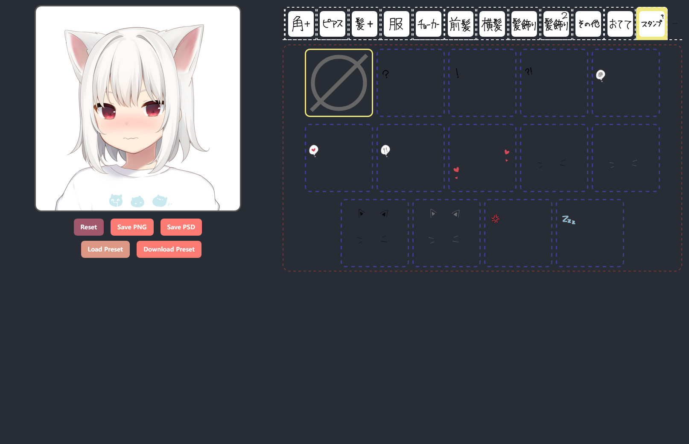
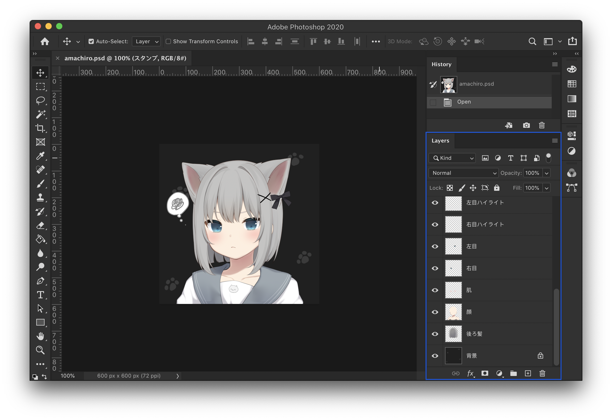

# amachiromaker

[Charlie Chiang](https://github.com/charlie0129) created this website since the [original one](https://picrew.me/image_maker/168503) was not accessible (as of November 2021; was taken down by its author 甘城なつき). Original website: [amachiromaker｜Picrew](https://picrew.me/image_maker/168503).

This website is not a one-to-one clone of the original one, rather it is rewritten from scratch using basic  React. This repository is a fork of [amachiromaker](https://github.com/charlie0129/amachiromaker).

**Note:** The original artwork (layers in the image) is ***not*** (and ***will not be***) provided due to copyright reasons. You have to download them yourself, if the servers happen to be alive. I am not responsible if you violate the license.

## How to Build

### Build or Develop Locally

Before you begin, make sure `node` (>= 20).

- Run `npm install` to install dependencies.
- Run `npm run build-static` to download original artworks. This may take a while.
  - By doing this, you agree that you will follow the license on the [original webpage](https://picrew.me/image_maker/168503) and are responsible for any consequences if you violate the license.
  - Optionally, you may use `npm run build-static --threads x` to enable parallel downloads, where `x` = number of threads (preferably `4`, setting it too high will cause the server to throttle you).
- Run `npm run dev` to start development server. Your browser should open shortly.

If you want to build the website, run `npm run build` to build the website. Static files will be located under `dist/`. Use any static file server to serve the directory. You can use `nginx` or `caddy` to serve the directory.

## Features

- Choose any combinations you want, with live preview.
- Auto save. Your changes will be preserved between page reloads.
- Download output image as `PNG` or `PSD` (with all the separate layers you can fiddle with).
- Download raw layer combination presets. You can load the preset and make changes to it later.

  <figure>
    
    <figcaption>Fig.1 - Screenshot</figcaption>
  </figure>
  <figure>
    
    <figcaption>Fig.2 - PSD Layers</figcaption>
  </figure>
  
Any of the artwork above will <b><i>not</i></b> be provided in this repository.

  
Copyright of the artwork belongs to the original author.

## Description of the Scripts

> Generally, you will **not** need to use these scripts. They will be executed automatically when generating static files.

- `scripts/data/` JSONs from the original website, containing layer info. Scripts below will use them.
- `scripts/findDefaultCombination.js` find out the layer combination to compose the default picture.
- `scripts/findDepth.js` order the layers by depth.
- `scripts/generateImgs.js` generate `scripts/data/imgs.json` to download all the layers from picrew CDN.
- `scripts/organizeData.js` reconstruct the original data to make it easier to use (mainly by combining image `src`s of different colors into layer objects).

#### If you find this project interesting, stars⭐️ are appreciated.